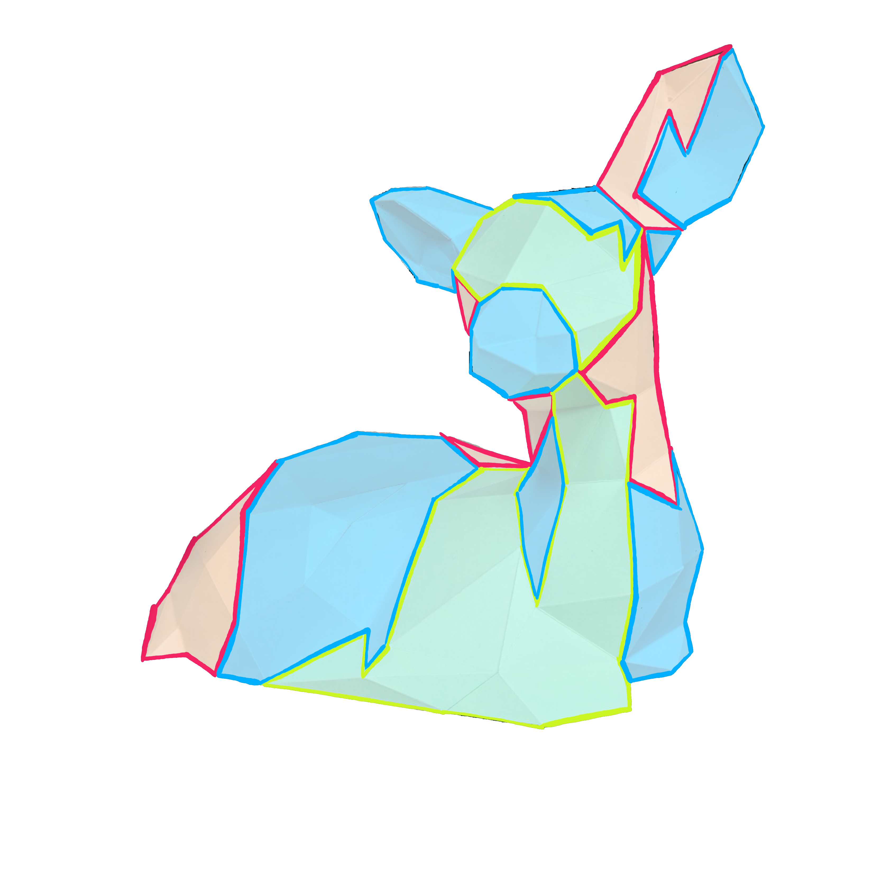

  

**Project Fawn** is an open-source platform for creating the next generation of fully custom, 3D-printed ski boots.  
Our goal is to reinvent ski boot design with a community-driven approach — open, transparent, and continuously improving.

---

## 🌐 Start Here
🔗 **[Visit the Project Fawn Website](https://projectfawn.com)** — Learn about the vision, see design updates, and get involved.

---

## 💡 Contribute
This repository is where the work happens.  
- 🛠️ **Discussions:** Share ideas, ask questions, and collaborate — [Join Discussions](../../discussions)
)
- 📝 **Issues & PRs:** Report bugs, propose features, or contribute code.

We believe innovation happens faster together — whether you're a designer, skier, engineer, or just curious, you're welcome here.

---

## 📜 License
Project Fawn is open-source and released under [choose-a-license] — contributions are encouraged and appreciated.

---

_This repository also contains the code for the Project Fawn website, built with Astro + Markdown and deployed via Vercel._
